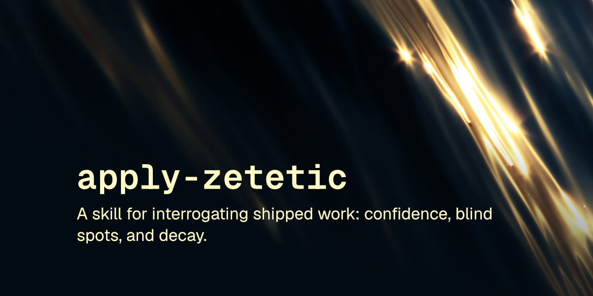

# socratic

Post-ship skill grills your work. 7 questions: confidence, blind spots, decay. No mercy.

 

A skill that interrogates recently shipped work with seven socratic questions, forcing evidence-backed answers about confidence, blind spots, decay, and unstated assumptions.

This skill follows the [Agent Skills specification](https://agentskills.io/specification) so it can be used by any skills-compatible agent.

## Installation

### npx skills
    npx skills add robcsaszar/socratic

### Marketplace
    /plugin marketplace add robcsaszar/socratic
    /plugin install robcsaszar-socratic@socratic

### Manually
Copy the `skills/socratic/` directory into your project's `.claude/skills/`.

## What it does

Run it after a feature merges or ships, naming a target: a feature, a change set (PR, branch, commit range), or the whole repository. The skill launches parallel research subagents to gather evidence, then answers seven questions in fixed order, each one grounded in a file, a line, a commit, or something observed in the session, never invented. The questions cover who the work is truly for and who was forgotten, the weakest certainty in what shipped, the most likely way it breaks in three months, the biggest unrealized blind spot, the assumptions never stated, what could have gone smoother, and one unrequested addition that would make the work stand out. It closes with at most three concrete follow-ups and names the answer that stung most.

Nothing gets fixed during the inquiry itself; it's an observation pass, with prescriptions reserved for the follow-ups.

## License
[MIT](LICENSE) © Rob Csaszar
